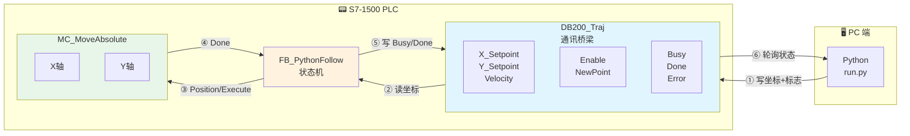
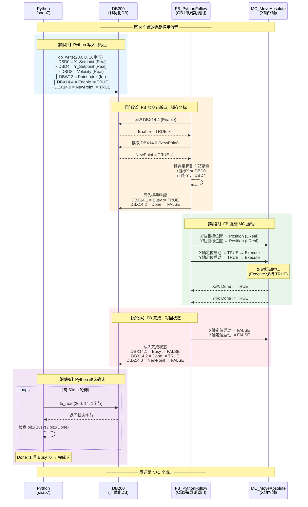
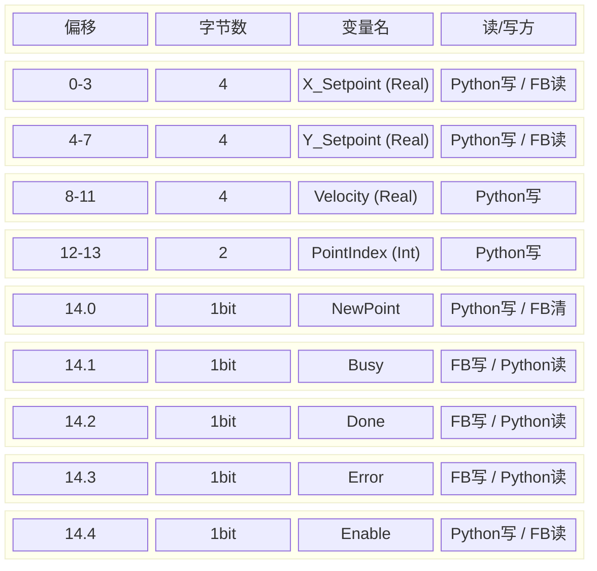
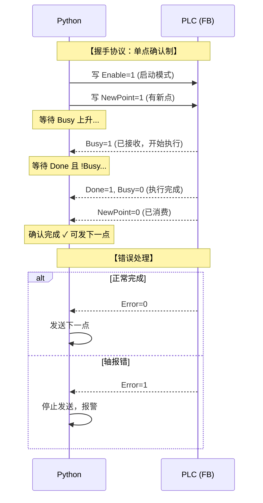
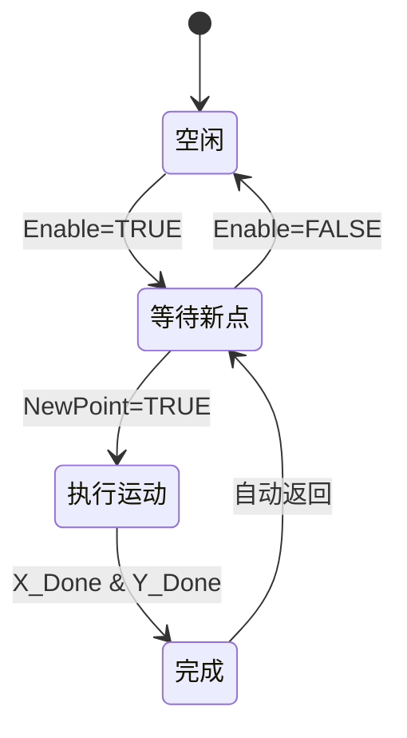

# Python-PLC 轨迹通讯架构

## 整体架构



## 时序图（详细版）



## DB200_Traj 内存布局



## 握手信号详解



## Python 代码与内存对照

| Python 代码 | DB200 地址 | 字节偏移 | 位偏移 | 说明 |
|------------|-----------|---------|-------|------|
| `set_real(data, 0, x)` | DBD0 | 0-3 | - | X 坐标 (4字节浮点) |
| `set_real(data, 4, y)` | DBD4 | 4-7 | - | Y 坐标 (4字节浮点) |
| `set_real(data, 8, v)` | DBD8 | 8-11 | - | 速度 (4字节浮点) |
| `set_int(data, 12, i)` | DBW12 | 12-13 | - | 点索引 (2字节整数) |
| `set_bool(data, 14, 0, True)` | DBX14.0 | 14 | bit0 | NewPoint 标志 |
| `set_bool(data, 14, 1, v)` | DBX14.1 | 14 | bit1 | Busy 标志 |
| `set_bool(data, 14, 2, v)` | DBX14.2 | 14 | bit2 | Done 标志 |
| `set_bool(data, 14, 3, v)` | DBX14.3 | 14 | bit3 | Error 标志 |
| `set_bool(data, 14, 4, True)` | DBX14.4 | 14 | bit4 | Enable 标志 |
| `get_bool(data, 0, 1)` | DBX14.1 | 14 | bit1 | 读 Busy |
| `get_bool(data, 0, 2)` | DBX14.2 | 14 | bit2 | 读 Done |

## 状态机



## 数据流对照表

| 步骤 | 方向 | 数据/信号 | 说明 |
|:---:|:---:|---|---|
| ① | Python → DB | X/Y/V + Enable + NewPoint | Python 写入目标点 |
| ② | DB → FB | X_Setpoint, Y_Setpoint | FB 读取坐标 |
| ③ | FB → DB | Busy = TRUE | FB 标记开始执行 |
| ④ | FB → MC | Position + Execute | 驱动 MC 运动 |
| ⑤ | MC → FB | Done | 轴到位反馈 |
| ⑥ | FB → MC | Execute = FALSE | 停止触发 |
| ⑦ | FB → DB | Busy=0, Done=1, NewPoint=0 | FB 标记完成 |
| ⑧ | DB → Python | Done = TRUE | Python 确认完成 |

## 关键代码

### Python 侧 (`run.py`)

```python
# 写入目标
set_real(data, 0, x)           # X_Setpoint
set_real(data, 4, y)           # Y_Setpoint
set_bool(data, 14, 4, True)    # Enable
set_bool(data, 14, 0, True)    # NewPoint

# 轮询状态
done = get_bool(data, 0, 2)    # Done 位
busy = get_bool(data, 0, 1)    # Busy 位
```

### PLC 侧 (`FB_PythonFollow.scl`)

```scl
// 读取坐标
#r目标X := REAL_TO_LREAL("DB200_Traj".X_Setpoint);
#r目标Y := REAL_TO_LREAL("DB200_Traj".Y_Setpoint);

// 输出到 MC
#X轴目标位置 := #r目标X;
#X轴定位启动 := TRUE;

// 写入状态
"DB200_Traj".Busy := TRUE;
"DB200_Traj".Done := TRUE;
```

## 一句话总结

> **Python 只负责往 DB200 写坐标和标志，FB 每周期自动从 DB200 读值并驱动 MC，最后把状态写回 DB200 给 Python 看——DB200 就是两边的"桥梁"。**

