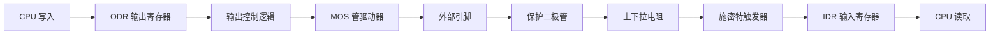

# 🏗️ 第2章：GPIO 内部架构深度解析

> **摘要**：本章深入 STM32 芯片内部，剖析 GPIO 的硬件电路结构。理解这些“微观结构”，是掌握 8 种工作模式的关键。

---

## 1. 🛡️ 保护与输入阶段

信号从引脚进入芯片，会经历层层关卡。

### 1.1 保护二极管 (Clamping Diodes)
*   **结构**: 两个二极管，一个接 VDD (3.3V)，一个接 VSS (GND)。
*   **作用**: 防止引脚电压过高或过低烧坏芯片。
    *   **电压 > VDD**: 上方二极管导通，电流泄放到 VDD。
    *   **电压 < VSS**: 下方二极管导通，电流从 VSS 补充。
    *   **注意**: 只能防静电或微弱过压，大电流还是会烧！

### 1.2 上拉/下拉电阻 (Pull-up/Pull-down)
*   **位置**: 在施密特触发器之前。
*   **作用**: 给引脚一个“默认电平”，防止浮空。
    *   **浮空 (Floating)**: 引脚什么都不接时，电压受噪声干扰在 0/1 间乱跳。**极度危险**，会导致误触发。
    *   **上拉**: 内部接电阻到 VDD → 默认高电平。
    *   **下拉**: 内部接电阻到 VSS → 默认低电平。

### 1.3 施密特触发器 (Schmitt Trigger) —— 信号整形师
*   **核心痛点**: 外部信号往往不干净（有毛刺、边缘缓慢、抖动）。
*   **解决方案**: 使用**双阈值**（滞回特性）进行滤波。
    *   **上限 ($V_{T+}$)**: 比如 1.8V。只有电压**超过**此值，输出才变 1。
    *   **下限 ($V_{T-})$**: 比如 1.2V。只有电压**低于**此值，输出才变 0。
*   **效果**: 将正弦波、噪声波整形为完美的**矩形方波**，送入 IDR 寄存器。

---

## 2. 💪 输出驱动阶段

当我们要输出信号时，由输出数据寄存器 (ODR) 控制最后的 MOS 管开关。

### 2.1 P-MOS 与 N-MOS
这是两个微小的电子开关，组成了输出驱动器。

| 模式 | P-MOS (接VDD) | N-MOS (接VSS) | 特点 |
| :--- | :--- | :--- | :--- |
| **推挽输出 (Push-Pull)** | 负责输出 **1** | 负责输出 **0** | **强劲**。高低电平都有强驱动力。适合点灯、通信。 |
| **开漏输出 (Open-Drain)**| **永远关闭** | 负责输出 **0** | **只拉低，不拉高**。输出 1 时呈高阻态，需外接上拉电阻。适合 I2C 总线。 |

### 2.2 为什么需要开漏输出？
*   **线与 (Wired-AND)**: 多个设备的引脚连在一起，只要有一个拉低，总线就是低。适合多机通信。
*   **电平转换**: STM32 是 3.3V。如果外接 5V 上拉电阻，开漏模式下可以安全驱动 5V 设备。

---

## 3. 🎛️ 8 种工作模式大总结

通过配置寄存器，我们可以组合上述硬件单元，实现 8 种模式：

### 输入模式 (Input)
1.  **浮空输入 (Floating)**: 纯读取，无电阻。适合外部已有驱动源的信号。**危险，慎用**。
2.  **上拉输入 (IPU)**: 内部接上拉。适合接按键（按键接GND）。
3.  **下拉输入 (IPD)**: 内部接下拉。适合接按键（按键接VDD）。
4.  **模拟输入 (Analog)**: **关闭施密特触发器**。信号直通 ADC。这是最“纯净”的模式，功耗最低。

### 输出模式 (Output)
5.  **推挽输出 (Out_PP)**: 最常用。输出 0V 和 3.3V。
6.  **开漏输出 (Out_OD)**: 输出 0V 和 高阻态 (需外部上拉)。
7.  **复用推挽 (AF_PP)**: 控制权交给外设 (如 UART_TX, SPI_MOSI)。
8.  **复用开漏 (AF_OD)**: 控制权交给外设 (如 I2C_SDA)。

---

## 4. 📝 寄存器图解

